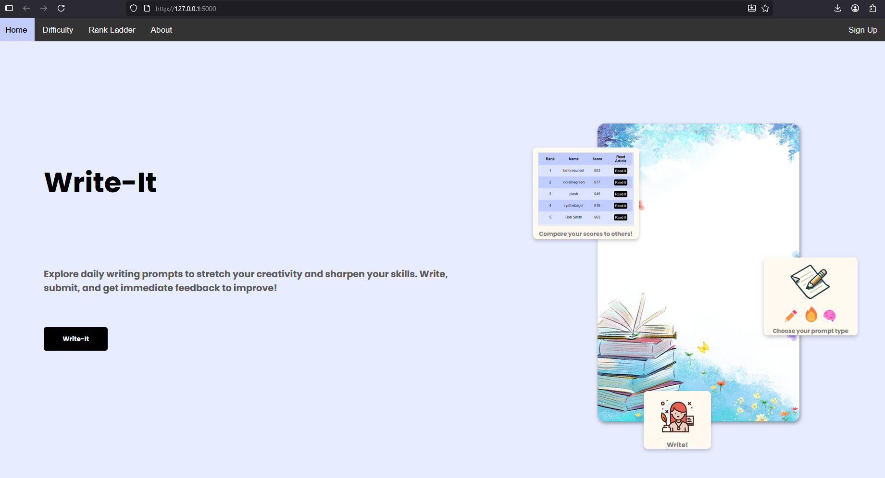
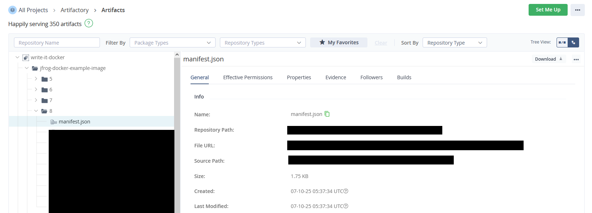
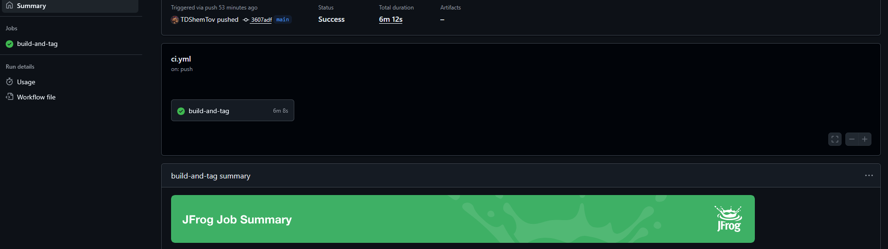
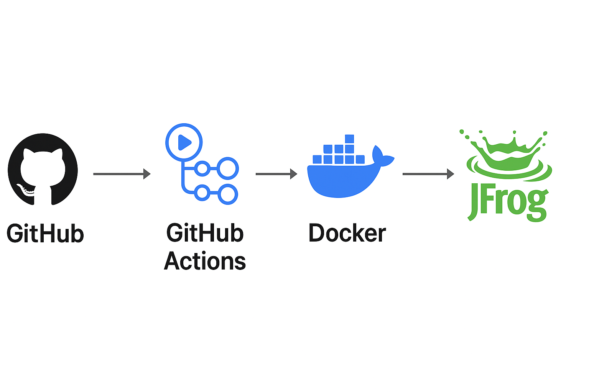

# Overview

This project adapts one of my existing full-stack applications to explore JFrog Artifactory and GitHub Actions in a practical CI/CD setup.
Because this repository is focused on demonstrating the DevOps pipeline, certain app features on `Rank Ladder`, `Difficulty`, `sign in/up` pages are disabled due to inactive MongoDB and OpenAI API keys.

If you’d like to see the original deployed version of the project in action, here’s a short video overview: https://www.youtube.com/watch?v=6r5PlXdLFdw

### Here are some screenshots to show it's working
1. **Docker build successful**
   

2. **JFrog Artifactory repository showing uploaded image**
   

3. **GitHub Actions workflow success**
   
    
4. **Pipeline Overview**
  

## Running the Project with Docker

To simplify local development and deployment, this project includes Docker and Docker Compose configurations. The application runs in a Python 3.13 environment and uses MongoDB for local development (production uses Azure Cosmos MongoDB).

### Requirements
- **Docker** and **Docker Compose** installed on your machine.
- The application is built with **Python 3.13-slim** and dependencies listed in `requirements.txt`.

### Services and Ports
- **python-app**: Flask web application
  - Exposes port **5000** (mapped to host port 5000)

### Environment Variables
- No environment variables are strictly required by default. If you have a `.env` file for secrets or configuration, uncomment the `env_file` line in `docker-compose.yml`.

### Build and Run Instructions
1. **Clone the repository** and navigate to the project root.
2. **Build and start the services**:
   ```bash
   docker compose up --build
   ```
   This will build the Python app image and start Write-It.
3. **Access the application** at [http://localhost:5000](http://localhost:5000).
